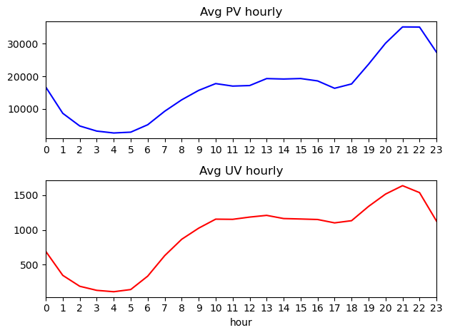
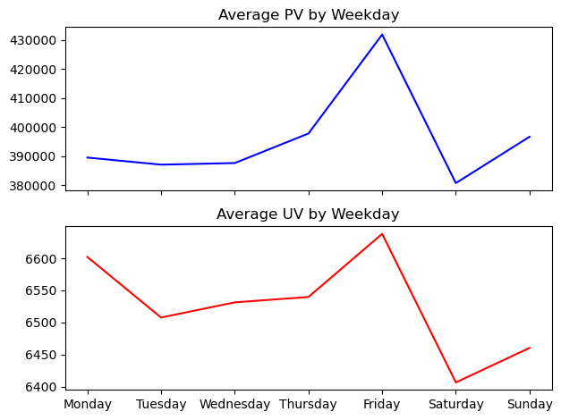
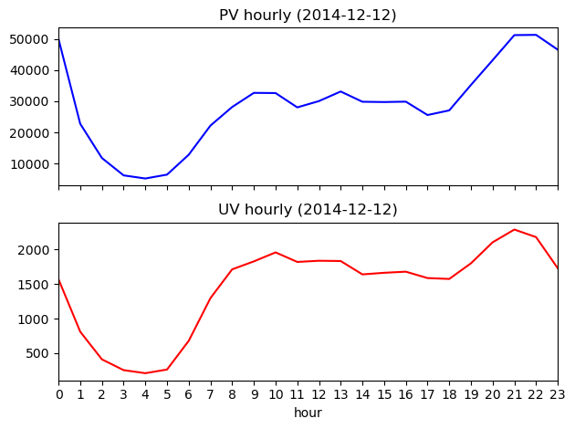
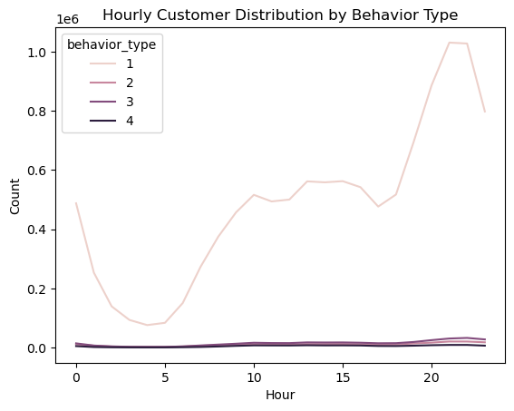
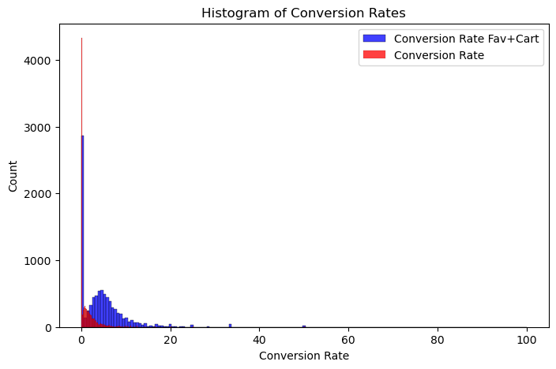
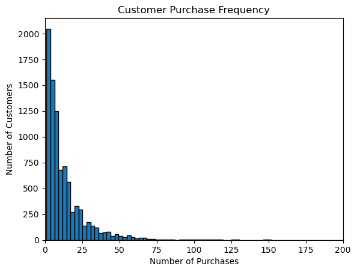
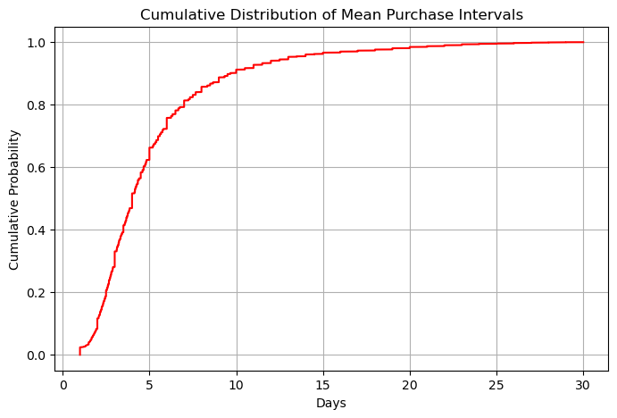

# Taobao User Behavior Analysis

Exploratory analysis of user interaction data to understand user visit patterns, preferences and payment behaviors.

## Project Overview
This project analyzes user behavior data from Taobao to identify patterns in browsing, liking, carting, and purchasing activities.
The goal is to understand how users move through the purchase funnel and to extract insights that could support
user segmentation, recommendation systems, and marketing strategies.

### Objectives
1. **Explore user visit patterns** by analyzing PV and UV across different time dimensions.  
2. **Understand user preferences** by analyzing product conversion rates and item categories.  
3. **Investigate user payment behaviors** based on purchase frequency and repeat purchases.

### Dataset
The dataset contains anonymized user interaction logs from the Taobao platform, including:
- User ID
- Item ID
- User behavior type (view, fav, cart, purchase)
- Item Category ID
- Timestamp

The dataset is not included in this repository due to size constraints.

### Tools and Libraries
- Python
- Pandas, NumPy
- Matplotlib / Seaborn
- datetime
- Jupyter Notebook

### Conclusions and Suggestions

1. Users are more active from 20:00 to 23:00. Friday has the highest PV and UV among the week. PV and UV are high at 0:00 on Dec 12. Most people just click the page without other behaviors:   

<table>
  <tr>
    <td></td>
    <td></td>
  </tr>
  <tr>
    <td></td>
    <td></td>
  </tr>
</table>

**Concentrate promotions during peak hours (20:00–23:00); Prioritize Fridays for major campaigns; Improve click-to-action conversion like clearer “Add to Cart” buttons, limited-time offers, or personalized recommendations.**  

2. Conversion Rate (Click → Fav+Cart): 5.07%. Conversion Rate (Fav+Cart → Purchase): 20.51%. Overall Conversion Rate (Click → Purchase): 1.04%.
Customer are actually likely to purchase if they favorite or add it to cart (20%), the problem is how to recommend the right product to them (5%). The 12.12 campaign effectively doubles the conversion rate from fav/cart to purchase, resulting in a doubled overall conversion rate.
Most items overall conversion rate and interest rate are below 10%. Over 47% items haven't been purchased and over 31% items were not interested:  

**Improve product recommendations to increase click → Fav/cart rates; Use targeted reminders and incentives for users who favorited or added items to cart; Analyzing the factors behind the highest ranked items to introduce more similar, high-potential products. And reconsider low-interest, no-purchase items; Replicate and optimize successful strategies from the 12.12 campaign for future sales.**  

3. The majority of customers have a low purchase frequency, with the highest number of users clustered near zero purchases. More than 87% of all the purchased users would purchase again. Over 95% repurchase occur within the first 15 days, and 90% happen within just 10 days.  

<table>
  <tr>
    <td></td>
    <td></td>
  </tr>
</table>

**Focus marketing efforts on encouraging first-time buyers to make a second purchase within the first 15 days; Implement timely post-purchase engagement like reminders, offers within the critical 10-15 day window; Develop loyalty programs targeting repeat customers to increase purchase frequency; Analyze barriers preventing low-frequency buyers from repurchasing and address them.**